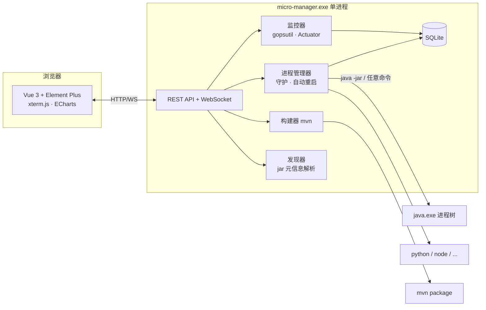

<div align="center">

# ⚙️ 微服务轻量管家

**单文件 · 零依赖 · 常驻 ~50MB 的本机服务管家**

告别 1~2GB 的 IDEA —— 用一个 exe 管理你机器上所有的服务


[功能特性](#-功能特性) · [快速开始](#-快速开始) · [构建项目](#-构建项目) · [任意语言服务](#-任意语言服务) · [HTTP API](#-http-api) · [FAQ](#-faq)

</div>

---

## 🤔 为什么需要它

微服务开发者的日常痛点：

| 场景 | 用 IDEA | 用本面板 |
|---|---|---|
| 内存占用 | 1~2 GB | **~50 MB** |
| 启动 10 个服务 | 逐个点 Run，误关 IDE 全崩 | 分组批量启动，崩溃自动守护 |
| 看服务日志 | 十几个 Tab 来回切 | 网页抽屉，随开随关 |
| 服务状态/健康 | 无 | CPU/内存曲线 + Actuator 健康 |
| 改完代码重新打包 | 手动敲 mvn | 面板内一键构建 + 自动扫描 |

> 它不写代码、不编译代码、不调试 —— 只做一件事：**把你的服务管好**。

## ✨ 功能特性

- 🔍 **自动发现** — 递归扫描目录下所有 Spring Boot jar（含子目录/`target/`），自动解析 `application.yml|properties` 的端口与应用名；自动跳过不可运行的库 jar
- 🌐 **任意语言** — 自定义服务：`python app.py`、`node server.js`、`go run .`、任意命令行，一视同仁地托管
- ▶️ **进程管理** — 启动/停止/重启；`taskkill /T` 整树退出不残留；崩溃后 5s 自动拉起（可按服务关闭）
- 👥 **分组批量** — 服务分组管理，一键启动/停止整组、全部
- 📜 **实时日志** — xterm.js 网页终端 + 文件落盘（按 50MB 切分，保留 3 份）+ 历史回看
- 📈 **资源监控** — gopsutil 采集 CPU/内存/线程，ECharts 实时曲线（60 点）
- 🩺 **健康检查** — TCP 端口探测判定 `running/starting`，Actuator 健康聚合 `UP/DOWN/unknown`
- 🔨 **面板内构建** — 一键 `mvn package -DskipTests`，实时构建日志，完成后自动扫描新服务
- ✏️ **服务元信息** — 每个服务可编辑端口、分组、说明注释、JVM 参数、启动命令
- 📂 **快捷目录** — 一键在资源管理器中打开服务所在文件夹
- 💾 **零运维持久化** — SQLite 单文件存一切；网页上改的扫描目录/服务信息重启不丢

## 🏗️ 架构



**技术栈**：Go 1.22+（gorilla/websocket · gopsutil · modernc.org/sqlite 纯 Go 无 CGO）+ Vue 3 + Element Plus + xterm.js + ECharts，前端 `vite build` 后经 `go:embed` 打进单一 exe。

## 🚀 快速开始

### 方式一：直接运行

```powershell
# 1. 下载/编译好的 micro-manager.exe 放到任意目录
# 2. （可选）同目录放 config.yaml
# 3. 双击运行，浏览器打开
http://localhost:9090
```

<details>
<summary><b>config.yaml 完整配置（都有默认值，可不放）</b></summary>

```yaml
server:
  host: 0.0.0.0      # 0.0.0.0 = 局域网可访问
  port: 9090         # 面板端口
scanDir: D:\svc      # 初始扫描目录（网页上改的会覆盖这里）
scanInterval: 30s    # 自动重扫周期
logDir: ./logs       # 服务日志落盘目录
logMaxSizeMB: 50     # 单文件上限，超过切分，保留 3 份
metricsInterval: 3s  # 资源采集周期
healthInterval: 10s  # 健康检查周期
restartDelay: 5s     # 崩溃自动重启延迟
stopTimeout: 10s     # 停止超时强杀
```

</details>

### 方式二：源码构建

```powershell
git clone https://github.com/llxpy/microservice-manager.git
cd microservice-manager

# 前端（产物 embed 进二进制）
cd web && npm install && npm run build && cd ..

# 后端（纯 Go，无 CGO，可直接交叉编译）
go build -ldflags "-s -w" -o micro-manager.exe .
```

## 🔨 构建项目

不需要 IDEA，不需要开终端：

1. 顶栏点 **🔨 构建项目**
2. 填项目目录（含 `pom.xml` 的那层）
3. 实时滚动 Maven 日志，可随时停止
4. 构建完成 → **自动重新扫描**，新服务直接出现在列表

相当于帮你执行 `mvn package -DskipTests`。

## 🌐 任意语言服务

面板不止管 Java。顶栏 **➕ 添加服务**：

| 字段 | 示例 |
|---|---|
| 名称 | `my-python-worker` |
| 启动命令 | `python app.py` / `node server.js` / `go run main.go` / `redis-server.exe` |
| 工作目录 | `D:\projects\worker` |
| 端口 | `8000`（用于探测与健康检查，可填 0 跳过） |
| 说明 | `定时任务消费者` |

这些服务和 Java 服务一样拥有：启停/守护/日志/资源曲线/分组批量。

每个服务还支持 **✏️ 编辑**（端口、说明、JVM 参数、启动命令）和 **📂 目录**（资源管理器直接定位到服务文件）。

## 📖 服务状态说明

| 状态 | 含义 |
|---|---|
| 🟢 running | 进程存活 && 端口可连接 |
| 🟡 starting | 进程存活，端口未就绪（Spring 启动中） |
| ⚫ stopped | 进程不在 |
| 🔴 failed | 非人为原因退出且未开启自动重启 |

健康列：`UP` 绿 / `DOWN` 红 / `unknown` 黄（连续 3 次检查失败或未配置健康地址）。

## 📡 HTTP API

| 方法 | 路径 | 说明 |
|---|---|---|
| GET | `/api/services` | 服务列表（含运行时状态） |
| POST | `/api/services` | 添加自定义服务 |
| PUT | `/api/services/:id` | 编辑服务（端口/说明/参数/命令） |
| DELETE | `/api/services/:id` | 移除服务（不删文件） |
| POST | `/api/services/:id/start\|stop\|restart` | 启停控制 |
| POST | `/api/services/:id/open-dir` | 资源管理器打开所在目录 |
| POST | `/api/groups/:group/start\|stop` | 分组批量 |
| GET | `/api/discovery/scan[?dir=]` | 扫描（可指定并持久化目录） |
| GET | `/api/logs/:id?lines=` | 历史日志 |
| GET/POST | `/api/settings` | 读取/保存设置 |
| POST | `/api/build` / `POST /api/build/stop` | 启动/停止构建 |
| WS | `/ws` | 实时日志 + 指标 + 状态推送 |

<details>
<summary>WebSocket 消息格式</summary>

```jsonc
// 服务端 → 前端
{ "type": "log",    "serviceId": "gateway", "data": "...log line...\n" }
{ "type": "status", "serviceId": "gateway", "status": { "state": "running", "cpu": 12.3, "memMb": 180, "health": "UP", ... } }
{ "type": "list",   "services": [ /* 扁平列表 */ ] }
{ "type": "build",  "state": "done", "message": "构建成功" }

// 前端 → 服务端
{ "action": "subscribe", "serviceId": "*" }
```

</details>

## ❓ FAQ

<details>
<summary><b>列表里只有几个库 jar，我的服务呢？</b></summary>

服务 jar 还没打包。点「🔨 构建项目」执行 Maven 打包；面板会自动过滤不可运行的库 jar（无 `BOOT-INF`）。
</details>

<details>
<summary><b>双击 exe 窗口一闪就没了？</b></summary>

大概率端口被占用（可能面板已在运行）。新版会显示原因并等待回车；旧版可先 `taskkill /F /IM micro-manager.exe`。
</details>

<details>
<summary><b>浏览器打开一直转圈？</b></summary>

检查代理软件是否拦截了 `localhost`，把 `localhost;127.0.0.1` 加入绕过列表。
</details>

<details>
<summary><b>健康一直 unknown？</b></summary>

未配置 healthUrl 或服务没有 actuator 依赖。在「编辑」里指定健康地址，或忽略该列（不影响其它功能）。
</details>

## 🗺️ Roadmap

- [ ] 服务依赖启动顺序编排
- [ ] 访问令牌（局域网暴露时鉴权）
- [ ] 日志关键字告警

## 📄 License

MIT
